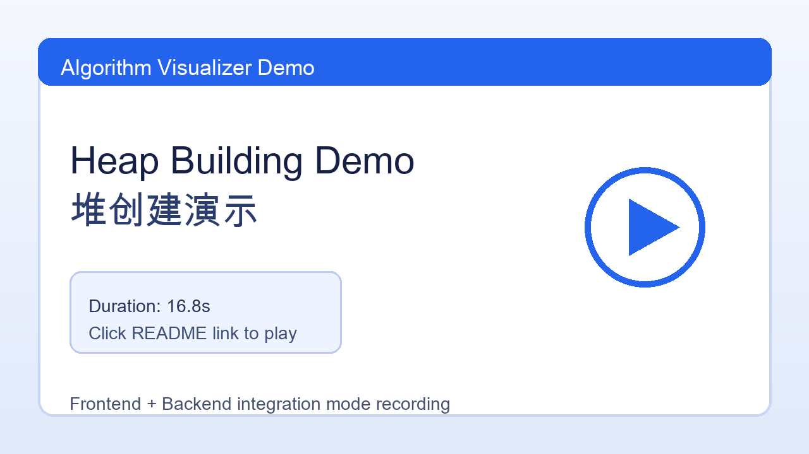
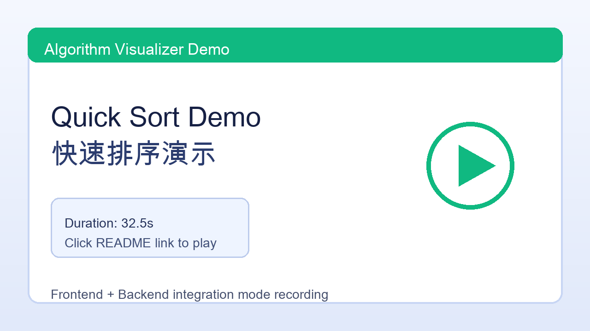

# 计算机网络专题实验：算法可视化演示系统

[English README](./README.md)

本项目对应《计算机网络专题实验》实验七，主题为“前后端网络协同的算法可视化系统”。本文档按实验报告模板（实验名称、原理、目的、内容、实现、测试、结论）重组，重点说明一次完整联调中“前后端不通”的根因链路，以及如何一步步调试并修复。

## 演示视频

> GitHub 对仓库内 `.mov` 文件的内嵌播放兼容性并不总是稳定。  
> 点击下方预览图可打开原始视频。

### 堆创建演示

[](./static-videos/Heap_Building.mov)

### 快速排序演示

[](./static-videos/Quick_Sort.mov)

## 1. 实验名称

算法可视化演示系统（实验七：Socket/网络编程专题）

## 2. 实验原理

系统采用浏览器-服务器（B/S）模型，核心通信分两条链路：

- HTTP 链路：用于任务提交与健康检查（`/api/visualize`、`/api/health`）。
- WebSocket 链路：用于实时双向控制与步骤推送（`/ws`，消息类型包括 `hello/start/pause/resume/step/reset/ping` 与 `connected/step/done/error/pong`）。

关键网络原理：

1. 端口可达不等于业务可用。`TCP LISTEN` 仅说明 L4 可达，仍需验证 L7 路由、协议实现与资源路径。
2. WebSocket 握手必须严格符合 RFC 6455。`Sec-WebSocket-Accept` 由客户端 key + 固定 GUID 计算，任何常量错误都会导致握手失败。
3. TCP 是字节流，不保证一次 `recv()` 拿到完整请求体。HTTP POST 的 JSON 体需要按 `Content-Length` 读满再解析。

## 3. 实验目的

- 完成前后端协同的算法可视化系统。
- 掌握 HTTP 与 WebSocket 在同一服务中的协同方式。
- 掌握云服务器部署中“监听地址、安全组、协议握手、请求分片”四类典型问题的排查方法。

## 4. 实验内容

### 4.1 基本功能

- 堆创建（必做）步骤可视化。
- 输入整数数组并提交任务。
- 演示控制：开始、暂停、继续、单步、重置。
- 健康检查接口与会话隔离（`sessionId`）。

### 4.2 高级功能

- 快速排序（选做）可视化。
- 本地演示模式（不依赖后端）与联调模式（依赖后端）双模式切换。
- WebSocket 自动重连与心跳机制。
- 基于 `runId` 的运行隔离，避免重复提交时步骤串流。

## 5. 实验实现

### 5.1 人员分工

- 江知远（计算机2301，2234412804）：前端实现、后端联调修复、云服务器部署、问题排查、文档整理。
- 司龙昆阳（计算机2303，2231110470）：前端调试、后端联调、云服务器搭建、问题排查、报告整理。

### 5.2 协议设计

- 传输协议：HTTP + WebSocket（均基于 TCP）。
- 端口策略：单端口 `8080`，后端同时托管静态页面、API、WS。
- 状态管理：后端按 `sessionId` 维护 `SessionState`，隔离不同用户会话。

### 5.3 UI 设计

- 左侧控制面板：算法、模式、数组输入、速度、控制按钮。
- 右侧步骤说明与 SVG 可视化画布。
- 状态提示：连接状态、演示状态、错误提示。

### 5.4 框架结构

- 前端：`index.html + style.css + main.js + socket.js + visualizer.js + mockRunner.js`。
- 后端：`backend/app.py` 单进程 socket server，采用线程处理连接。
- 并发方式：每个 HTTP/WS 连接由线程处理；会话数据集中存放在 `SESSIONS` 字典。

## 6. 关键代码说明

### 6.1 后端入口与路由

- 文件：`backend/app.py`
- 功能：
  - `GET /` 与静态资源返回（避免“只能 API 通，页面 404”）。
  - `GET /api/health` 健康检查。
  - `POST /api/visualize` 任务提交与参数校验。
  - `GET /ws` WebSocket 握手与实时消息通道。

### 6.2 会话与步骤生成

- `SessionState`：维护算法类型、输入数据、暂停/单步状态。
- `build_heap_steps` / `build_quick_steps`：生成结构化 step payload，前端据此渲染。

### 6.3 前端联调地址构造

- 文件：`src/main.js`
- 改进点：不再硬编码固定 IP，统一基于 `window.location` 生成：
  - `API_BASE = http(s)://<host>:8080`
  - `WS_URL = ws(s)://<host>:8080/ws`
- 意义：同一代码可在本机/云端直接运行，减少环境耦合。

## 7. 测试与结果分析（重点：前后端不通问题）

### 7.1 问题一：端口在监听，但访问主页 404

现象：

- `ss -lntp | grep 8080` 显示监听正常。
- `curl /api/health` 正常。
- 浏览器访问 `http://<公网IP>:8080/` 返回 404。

根因：

- 后端仅实现 API/WS，未实现 `GET /` 与静态资源托管。

调试步骤：

1. 用 `curl -I /` 与 `curl /api/health` 对比 L7 路由行为。
2. 核查 `app.py` 路由分支，确认缺少静态托管。
3. 增加 `/`、`/index.html` 与静态文件返回逻辑。

结果：

- 主页可访问，单端口入口建立。

### 7.2 问题二：联调模式无法切换或页面“点不动”

现象：

- 页面可打开，但联调控件异常。

根因：

- 前端初始化在特定 HTTP 场景下触发运行时兼容问题（如 `crypto.randomUUID()` 不可用），导致事件绑定中断。

调试步骤：

1. 检查控制台脚本报错。
2. 在 `main.js` 增加 sessionId 降级生成逻辑。
3. 强制刷新浏览器缓存验证新脚本生效。

结果：

- 模式切换与按钮交互恢复。

### 7.3 问题三：WebSocket 持续重连

现象：

- 状态长期停留“重连中”，`connected` 不稳定。

根因：

1. 握手 GUID 配置错误，导致 `Sec-WebSocket-Accept` 计算不符合 RFC 6455。
2. 控制帧（ping/pong）处理不当导致消息循环提前退出。

调试步骤：

1. 抓握手响应头，核对 `101 Switching Protocols`。
2. 校验并修正 GUID 常量。
3. 调整控制帧处理逻辑，避免误断开。

结果：

- 联调模式可稳定建立 WS 连接。

### 7.4 问题四：提交任务提示“无效 JSON”

现象：

- 前端输入合法，后端偶发返回 `无效 JSON`。

根因：

- POST 请求体分片到达；后端未按 `Content-Length` 读满就直接 `json.loads`。

调试步骤：

1. 构造分片请求复现。
2. 在 HTTP 处理函数中增加“按 `Content-Length` 补齐 body”逻辑。
3. 重复分片测试确认稳定通过。

结果：

- 任务提交成功率恢复稳定。

### 7.5 问题五：重复提交后两次运行步骤混在一起

现象：

- 快速连续点击“提交并开始”后，前端步骤流出现前一次和后一次混合。

根因：

- 同一个 `sessionId` 下，旧任务线程和新任务线程同时推送，缺少“当前最新任务”判定。

调试步骤：

1. 前端每次提交生成新的 `runId`，并在 HTTP `POST /api/visualize` 与 WS `start` 同时携带。
2. 后端在会话状态中记录 `current_run_id`，仅允许最新 `runId` 启动与持续推送。
3. 步骤推送循环中每次发送前校验：若线程 `runId` 已过期则立即停止。
4. 前端收到 WS 消息时，若 `msg.runId` 与当前 `state.runId` 不一致，则直接丢弃。

结果：

- 重复提交后仅最新任务持续推送，旧任务不会再污染当前演示。

## 8. 部署与运行步骤（最终版）

```bash
# 1) 进入后端
cd backend

# 2) 安装依赖
python3 -m pip install -r requirements.txt

# 3) 启动服务（单端口）
python3 app.py

# 4) 浏览器访问
# http://127.0.0.1:8080/
# 或 http://<公网IP>:8080/
```

快速验证：

```bash
curl -s http://127.0.0.1:8080/api/health
curl -s -X POST http://127.0.0.1:8080/api/visualize \
  -H 'Content-Type: application/json' \
  -d '{"sessionId":"demo-1","runId":"run-001","algorithm":"heap_build","input":[7,2,9,1,5,8,3,6,4]}' 
```

重复提交防串流快速验证：

1. 连续提交两次（`run-001`、`run-002`）。
2. 预期：只看到 `run-002` 的 `step/done` 持续更新；旧任务自动停止。
3. 人工发送过期 `runId` 的 WS `start` 时，后端返回 `stale run: 不是当前最新任务`。

## 9. 实验结论

本实验完成了一个可在云服务器部署的前后端协同可视化系统。通过对“端口通但页面不通、WS 重连、JSON 解析失败”等真实故障的逐层排查，验证了网络应用调试应遵循“链路分层 + 协议对齐 + 数据完整性”方法：先确认可达，再确认路由，再确认协议，再确认数据边界。

## 10. 总结与心得

- 仅看端口监听很容易误判，需要配合接口与页面路由一起验证。
- WebSocket 对握手细节非常敏感，常量错误会导致整体不可用。
- HTTP 请求体处理必须尊重 `Content-Length`，尤其在原始 socket 服务器实现中。
- 单端口统一入口（页面+API+WS）可显著降低部署与联调复杂度。

## 11. 附件与参考

- 源码目录：`backend/`、`src/`
- 演示视频：`static-videos/`
- 报告模板：`实验七报告模板 2026.docx`
- 协议参考：
  - RFC 6455（WebSocket）
  - HTTP/1.1 报文与 `Content-Length` 机制

## 许可证

本项目采用 [MIT License](./LICENSE)。
